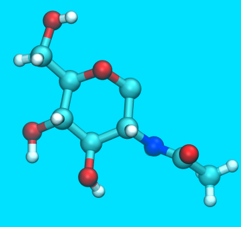

# chitin_builder
Chitin builder is a VMD plugin that generates crystal coordinates and structural/topology files of alpha or beta chitin for use in MD simulations.

*Developed by D. C. Malaspina and J. Faraudo at Institut de Ciencia de Materials de Barcelona (ICMAB-CSIC)*

[soft matter theory group - ICMAB-CSIC](https://departments.icmab.es/softmattertheory/)

----------------------------------------------------------------
## Citation

*D.C. Malaspina and J. Faraudo (2019)*

-----------------------------------------
## Files

* chitin-gui.tcl: main code file in tcl language.

* icon.png: image of a chitin monomer.

* install.sh: bash script for installation under Linux.

* LICENCE: GNU v3 licence file.

* pkgIndex.tcl: subprogram in tcl for registering chitin builder into VMD menu.

* /structures/alpha-4residues.pdb: initial structure for alpha chitin.

* /structures/beta-4residues.pdb: initial structure for beta chitin.

* /structure/top_all36_carb.rtf: CHARMM36 carbohydrate topology file for generating psf files.

* /Forcefield/par_all36_carb.prm: CHARMM36 carbohydrate parameters file for running a simulation.

* /examples/: several examples of generated structures using chitin builder. Each subfolder contains a screenshot of the input parameters and the output files.

-----------------------------------------

## Installation

Please download and unzip the code from the Download button in this GitBucket or clone by git clone.To 
To add the builder to the standard VMD extensions-modelling menu, please select the appropiate instructons depending on your OS:

-----------------------------------------
* **Ubuntu (automatic)**

Make the file install.sh executable 
From a terminal execute ./install.sh

Open VMD. Now you should have the Chitin_Builder menu installed under Extensions/Modeling/Chitin Builder/

Note: The installation script assumes that VMD is localted in the default folder /usr/local/lib. You can modify this setting by editing the install.sh file with any editor of your choice.

-------------------------------------------
* **All Linux (Manual installation)**

1) Locate the vmd folder in which the program VMD is installed. By default is /usr/local/lib/vmd  
Inside the vmd folder, locate the folder vmd/plugins/noarch/tcl/ that contains many plugins written in tcl language.
Inside this tcl folder, create a new folder with the name chitin1.0

2) Copy or move the chitin builder that you have downloaded to this new folder. You need superuser privileges.
For example, in ubuntu you can open a terminal inside the folder of the chitin buildir that you just extracted and type:

sudo cp -r * /usr/local/lib/vmd/plugins/noarch/tcl/chitin1.0/

(this example above assumes that VMD is installed in the default folder /usr/local/lib/vmd/)

3) Open VMD. Now you should have the Chitin_Builder menu installed under Extensions/Modeling/Chitin Builder/

-------------------------------------------
* **Windows (Manual installation)**

1) Locate the vmd folder in which the program VMD is installed. 
A typical location is C:\Program Files (x86)\University of Illinois\VMD

Inside the vmd folder, locate the folder /plugins/noarch/tcl/ that contains many plugins written in tcl language.
Inside this tcl folder, create a new folder with the name chitin1.0

2) Copy or move the chitin builder files that you have downloaded to this new folder. 

3) Open VMD. Now you should have the Chitin_Builder menu installed under Extensions/Modeling/Chitin Builder/

-------------------------------------------
* **MAC (Manual installation)**

1) Locate the VMD application using Finder

A typical location is /Applications/VMD

Right click on the VMD application to open the options and click on "Show Package Contents", this will open a folder with all VMD installation.

Inside the vmd folder, locate the folder vmd/plugins/noarch/tcl/ that contains many plugins written in tcl language.
Inside this tcl folder, create a new folder with the name chitin1.0

2) Copy or move the chitin builder that you have downloaded to this new folder. 

3) Open VMD. Now you should have the Chitin_Builder menu installed under Extensions/Modeling/Chitin Builder/

## Usage

The chitin builder gui allow the user to select between different options for the generation of a chitin crystal.

1) **Crystal allomorph button:** you can choose between alpha and beta chitin allomorphs.

Data of the unit cell used for the generation of the new crystal would appear under crystal allomorph button.

2) **Number of replicas input:** you can enter the number of replicas that the new crystal structure is going to contain. This number should be an integer.

3) **Periodic bonds button:** if this option is set to "yes" a bond between the first residue and the last residue in each chain will be generated. This allow to create infinitely long chains if used with periodic boundary conditions.

4) **Generate chitin structure button:** will prompt a dialog box for the destination folder and will generate a PDB + PSF file named: "crystal-alpha-psf.pdb / psf or crystal-beta-psf.pdb / psf" with the crystal structure and topology file.

The data for the new crystal cell would be print under the generate structure button and the same data will be print on the file "crystal.log".
